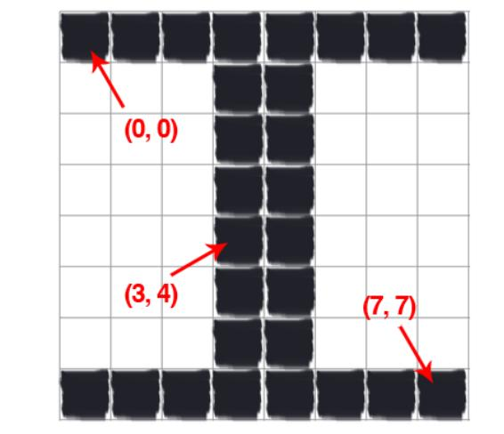
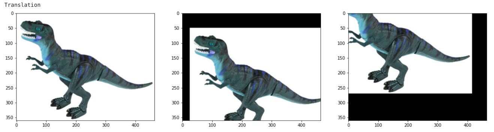
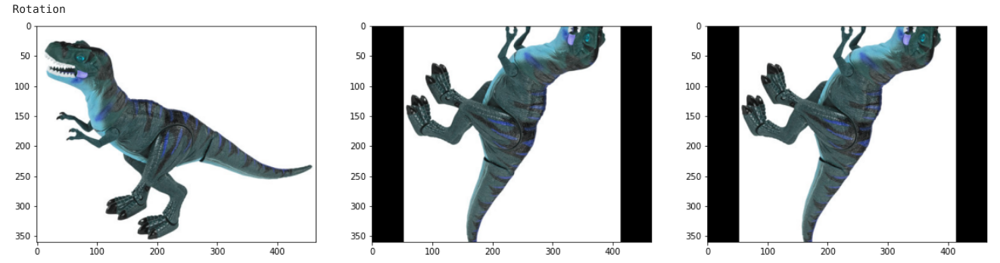
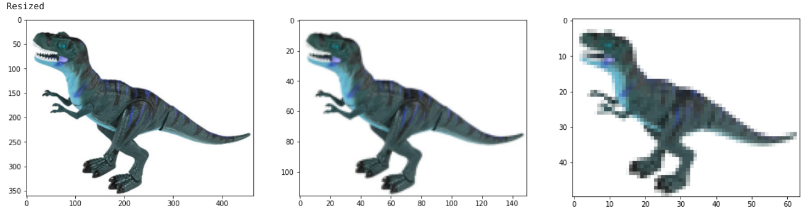
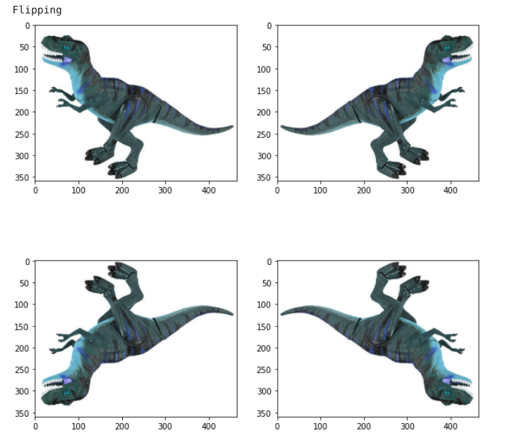
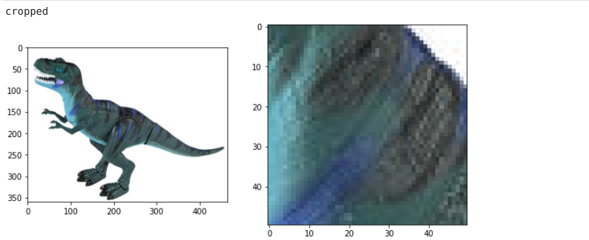

# PRACTICAL PYTHON AND OPEN CV
This repository implements codes from book practical python and open cv

When python openCV reads image, we can get width, height, channels from shape of the image

```python

image = cv2.imread(args["image"])
print("width: {} pixels".format(image.shape[1]))
print("height: {} pixels".format(image.shape[0]))
print("channels: {}".format(image.shape[2]))

cv2.imshow("Image", image)
```

### Image Basics

**Pixel**
Raw building blocks of the images. Finest granularity in the image. Image is build up of pixels in 2D array (width, height). 
Each image has channels, 
- 1 channel --> grayscale image
- 2 channel
- 3 channel --> RGB Color image



OpenCV stores RGB pixels in **reverse order**, so when we unpack and access each element in the tuple, we are actually viewing them in BGR order


### Image Processing

#### Translation


#### Rotation



#### Resized


#### Flipping


#### Cropped

